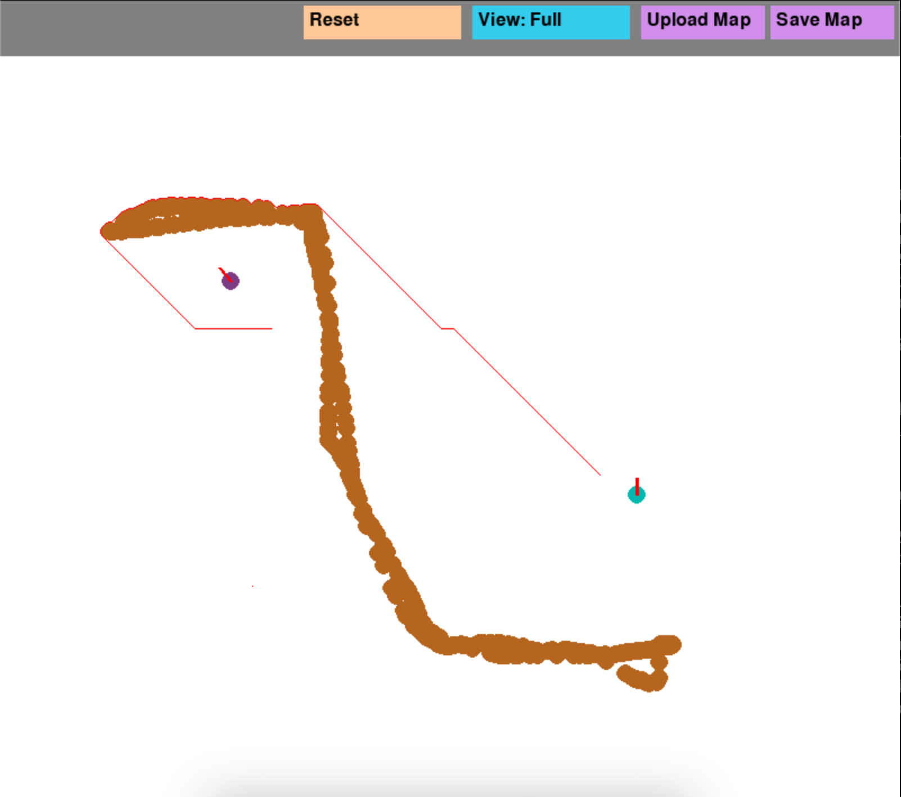
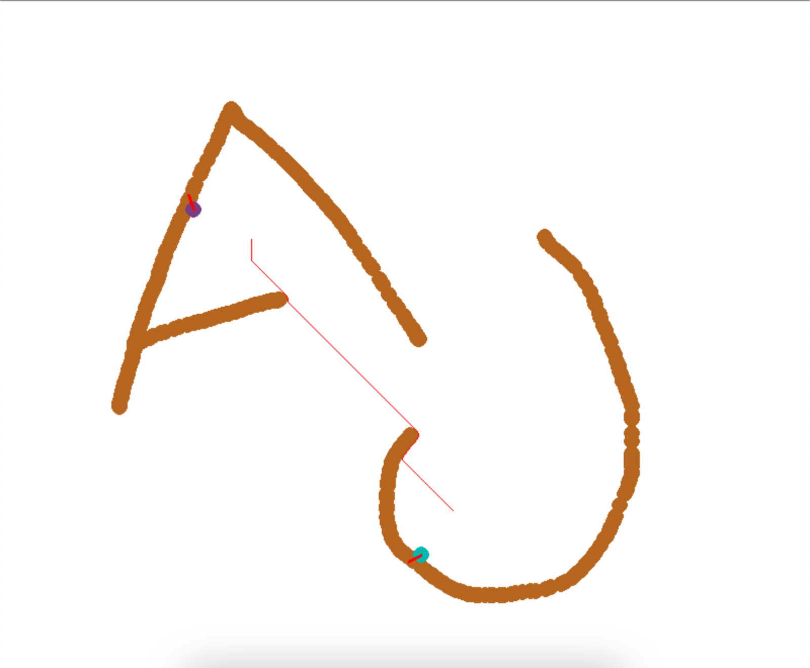
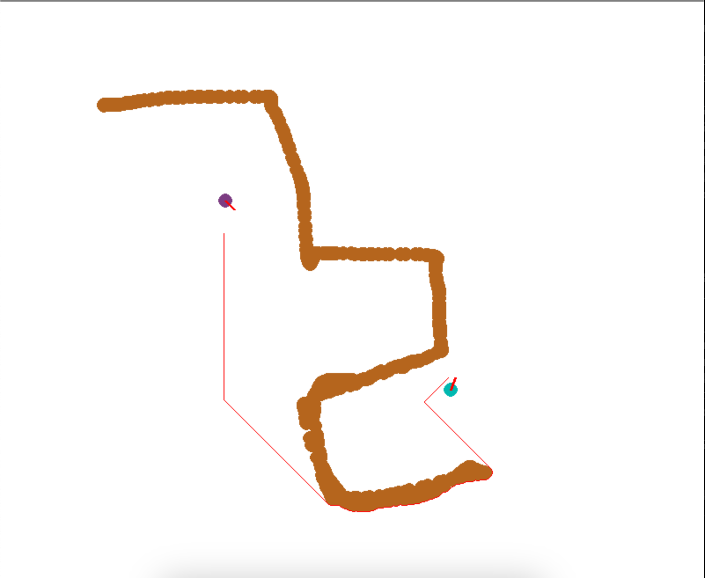

# Autonomous Multiagent navigation Pipeline

Initially only ** the world map and lidar readings ** of 2 agents are given using them, they are made to meet somewhere on the map.

## Approach for localization
- Particle filtering algorithm is used.
- Some number of particle are initialized randomly on the map.
- Agent is moved and using the lidar data and simulated lidar readings for each particle (on the map given), weights are assigned to particles.
- We then filter particles based on these weights.
- Run the above process multiple times.

## Approach for path planning
- The final estimated position will be the mean of the final filtered particles.
- Then A* pathfinding algorithm is applied the find the shorted path between these positions

## Drawbacks
- Takes considerable amount of time for processing
- Non symmetrical maps may give better results
- Due the time it takes, the number of particles initialized are set to be 150, accuracy of prediction can be improved by increasing the number of particles.

> These are some the results on the following maps

